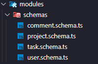
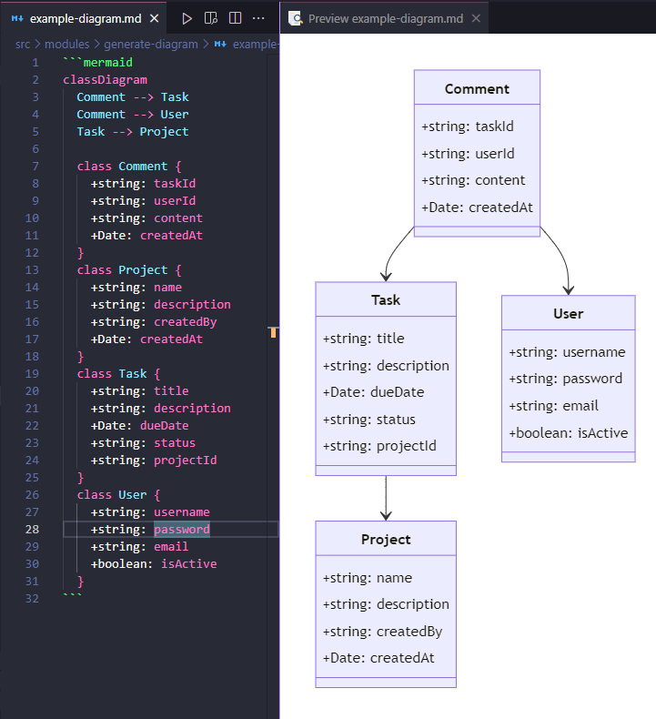
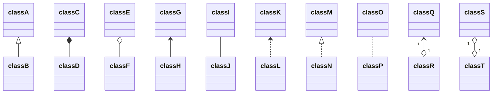

# mongo-diagram-builder

Create automatic mongo UMLs diagrams from your MongoDB database schema.

## Installation
```bash
npm i -g mongo-diagram-builder
```

## Usage

**IMPORTANT: This package currently only supports NestJS and Mongoose, with the Schema pattern found in the example below. If you are using a different framework or library, you may need to modify the code accordingly, or look for another package.**

1. In your project directory, create a `mongo-diagram-builder.config.js` file with the following content:
```bash
module.exports = {
  sourceDir: './your-mongodb-schema-directory',  // Change this to the directory containing your MongoDB schema files
  fileExtension: '.schema.js',                   // Change this to the file extension of your MongoDB schema files
  outputDir: './your-output-directory',          // Change this to the directory where you want to save the generated UML diagrams
  outputFileName: 'diagram-name-file',           // Change this to the desired output file name
}
```

2. Run the `mongo-diagram-builder` command line after creating the configuration file:
```bash
npx mongo-diagram-builder create
```

This will generate a UML diagram for each MongoDB collection in the specified directory, and save them in the specified output directory with the provided output file name with MarkDown extension.

## Example 

1. Let's assume we have a MongoDB schema with the collections `Task`, `User`, `Project`, and `Comment`. They follow the standard mongoose structure as represented below:

```javascript
@Schema({ collection: 'comments', timestamps: true })
export class Comment extends Document {
  @Prop({ required: true, type: Schema.Types.ObjectId, ref: 'Task' })
  taskId: string;

  @Prop({ required: true, type: Schema.Types.ObjectId, ref: 'User' })
  userId: string;

  @Prop({ required: true })
  content: string;

  @Prop({ default: Date.now })
  createdAt: Date;
}

export const CommentSchema = SchemaFactory.createForClass(Comment);
```

The schema for all tables in this example will be created in a `schema` folder as shown below, but it is not necessary for all schemas to be in this folder. They can be separated within an application module; in this case, you would point to the main project folder.

- Example folder structure:


**Obs:** ***Relations must follow the 'nameClassId' pattern, if the property does not follow this pattern the code will not understand the relations***

2. Now, to configure the project, I will include the  `mongo-diagram-builder.config.js` file with the settings:

After running the command `mongo-diagram-builder create`, you will see the generated UML diagram in `./` with the name `example-diagram.md`.

3. Diagram generated example:


4. If you want relations yourn classes, follow the mermaid sintax founded in [Mermaid Documentation](https://mermaid.js.org/syntax/classDiagram.html). for example:
```bash
classDiagram
classA <|-- classB
classC *-- classD
classE o-- classF
classG <-- classH
classI -- classJ
classK <.. classL
classM <|.. classN
classO .. classP
classQ "n" <--o "1" classR
classS "1" o--o "1" classT
```


## Contributors

<table>
  <tr>
    <td align="center">
      <a href="#">
        <br>
        <sub>
          <b>Diogo Gallina</b>
        </sub>
      </a>
    </td>
  </tr>
</table>
Copyright (c) 2024
